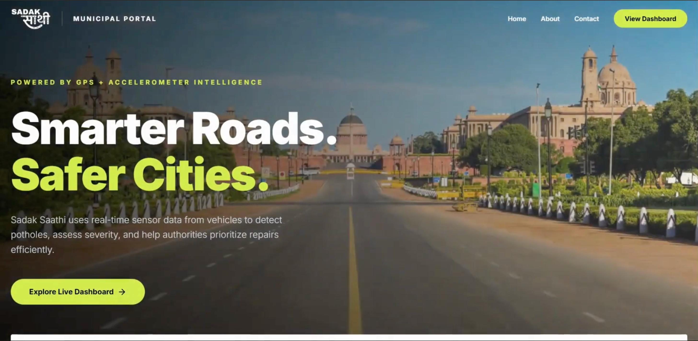
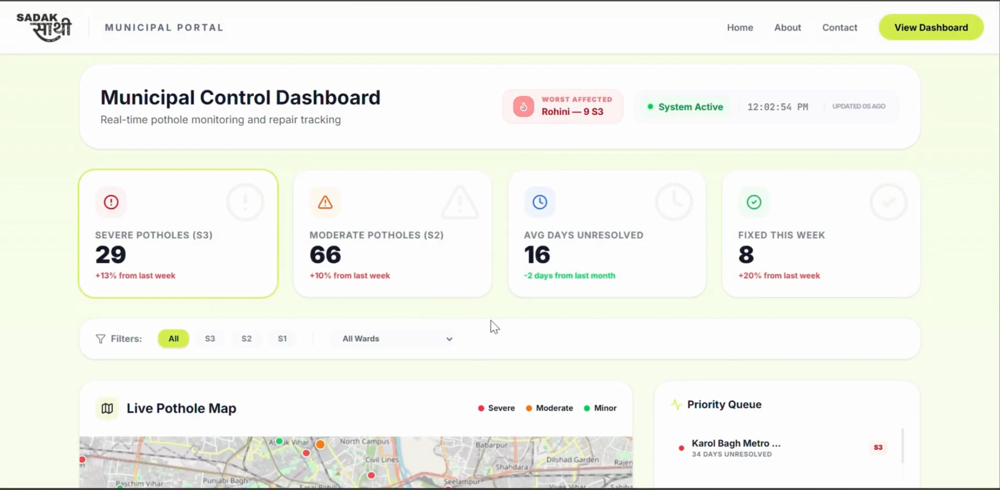
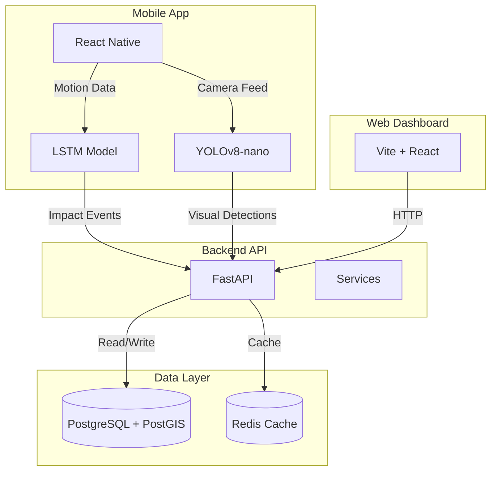

# Sadak Saathi

**Delhi's Two-Wheeler Safety & Road Accountability Network**

---

## Demo Video

https://github.com/user-attachments/assets/4df054da-62da-42d7-aece-a58312a09078

---

## App Screenshots

### Home Page
<p align="center">
  
</p>

*Dashboard overview with quick stats and access to main features*

### Community Map
<p align="center">


  
</p>

*Live map showing confirmed hazards and safe routes*

### Hazard Detail
<p align="center">
  
</p>

*Detailed view of a pothole, including contractor info and economic damage*

### Web Dashboard - Home
<p align="center">
  
</p>

*Public-facing dashboard showing hazard overview and live statistics*

### Web Dashboard - Contractor Details
<p align="center">
  
</p>

*Contractor accountability page with performance scores and economic damage tracking*

---

## The Problem

Potholes are more than just an inconvenience—they're a deadly hazard that claims thousands of lives every year. Delhi, with its massive two-wheeler population, is particularly vulnerable.

| Impact | Numbers |
|--------|---------|
| Two-wheeler deaths (potholes, 5 years) | **9,438 deaths across India** |
| Annual vehicle damage | **₹3,000 Cr** |
| Annual traffic delay cost | **₹450 Cr** |

The situation is alarming:
- **Water-filled potholes** cause 70% of two-wheeler accidents—they look shallow (2cm) but can be 10-15cm deep
- At speed, hitting a water-filled pothole causes complete loss of control
- Current reporting systems rely on citizen complaints, which are slow and inconsistent
- Most potholes go unreported for weeks, causing cumulative damage

But here's the key insight: **Every rupee is traceable. Every pothole has a contractor responsible.**

When a road is repaired, contractors are paid. When that repair fails within the warranty period (Defect Liability Period), the contractor is responsible for fixing it at no additional cost. But currently, there's no system to track which contractor is responsible for which pothole, or calculate the economic damage caused by their negligence.

---

## The Solution

**Sadak Saathi turns 3 lakh delivery riders into a passive road-intelligence network.**

Delhi has approximately **3 lakh (300,000) delivery riders** from companies like Zomato, Swiggy, Zepto, and Blinkit. These riders cover every road in the city multiple times daily, 24/7. Their phones already have accelerometers and cameras—everything needed for pothole detection.

### How It Works

1. **Delivery riders install the app** → It runs in the background alongside delivery apps like Zomato or Swiggy
2. **Zero behavior change required** → Detection happens passively during their normal delivery routes
3. **Network effect kicks in** → 15 confirmations by lunchtime vs. 3 citizen reports in a week

The beauty of this approach is that it transforms a selfish behavior (delivering food) into a civic benefit (mapping potholes)—similar to how Waze turned driving into road data collection.

---

## Features

### 1. Dual Detection System

Sadak Saathi uses two complementary detection methods that work together:

#### Accelerometer Detection (Always On)

The accelerometer runs continuously in the background, processing 3-axis sensor data at 50Hz using an on-device LSTM (Long Short-Term Memory) neural network.

**How it works:**
- The phone's accelerometer detects sudden vertical impacts
- The LSTM model processes a sliding window of 100 samples (2 seconds of data)
- It classifies each impact into severity levels:
  - **S1 (Minor):** Slight bump, minor inconvenience
  - **S2 (Moderate):** Noticeable impact, potential vehicle damage
  - **S3 (Critical):** Severe impact, high risk of accident

**Technical details:**
- Model accuracy: ~89%
- Inference time: <15ms on mobile processors
- Can distinguish between potholes, speed bumps, rail crossings, and normal road texture
- Runs entirely on-device using TensorFlow Lite—no server cost, works offline

#### YOLO Camera Detection (Mounted Mode)

When the phone is mounted on the bike's handlebars (detected via orientation sensor) and the device is moving, the camera automatically activates.

**How it works:**
- YOLOv8-nano processes the camera feed at 8-10 frames per second
- The model detects and classifies visual hazards:
  - **Dry potholes:** Standard road damage
  - **Water-filled potholes:** High priority—cause 70% of accidents
  - **Edge crumbling:** Road deterioration
  - **Debris:** Roadside objects
  - **Clusters:** Multiple potholes in one area

**Technical details:**
- Model: YOLOv8-nano (3.2M parameters, 6.2MB size)
- Input: 640×640 RGB images
- mAP@0.5: ~84%
- Water-filled detection precision: ~94%
- Inference: ~95ms per frame on Snapdragon 665

#### Confirmation Engine

Neither sensor is perfect on its own, so Sadak Saathi uses a confirmation system:

- **10+ accelerometer reports** → Confirmed pothole
- **YOLO + accelerometer agreement** → High confidence
- **Water detection >91%** → Immediate alert (bypasses normal confirmation threshold due to high danger)

The backend clusters reports within a 5m radius to prevent duplicate entries and filter GPS noise.

---

### 2. Live Hazard Alerts

Once a pothole is confirmed, the system needs to warn riders before they reach it.

**How it works:**
- When navigation is active, the app queries hazards along the route every 10 seconds
- When within 400m of a confirmed hazard, a voice alert fires
- The alert includes: distance to hazard, severity level, lane position, and recommended action
- Works over any navigation app (Google Maps, etc.) since it uses the phone's audio output

**Alert priority levels:**
- **S1:** Gentle notification, "Pothole ahead"
- **S2:** Clear warning, "Moderate pothole ahead, please slow down"
- **S3:** Urgent alert, "Critical hazard ahead, reduce speed immediately"
- **Water-filled:** High-priority alert regardless of size

---

### 3. Safe Route Navigation

Route scoring combines real-time road conditions with live traffic data to offer riders the best path.

**How it works:**
- Users can choose between "Fastest" (standard navigation) and "Safe" (avoids known hazards) routes
- The routing algorithm weights:
  - Number and severity of known hazards on each road segment
  - Live traffic density
  - Road type (highways vs. local roads)
- Shows both options side-by-side with estimated time difference

This is particularly valuable for delivery riders who need to balance speed with safety.

---

### 4. Public Accountability

This is where Sadak Saathi truly innovates—linking every pothole to the contractor responsible and calculating economic damage.

#### Contractor Matching

Every road segment in Delhi is under contract with a specific contractor (for PWD roads). Sadak Saathi uses geospatial queries to:

1. Match each confirmed pothole to the responsible contractor
2. Track the Defect Liability Period (DLP) for that road:
   - Major roads: 5 years
   - Minor roads: 3 years
3. Determine if the contractor is still within warranty

#### Economic Damage Calculation

The system calculates the true cost of each pothole:

**Vehicle Damage:**
- Count of S2+ impacts at this location
- × Average repair cost (₹6,000)
- = Total vehicle damage

**Traffic Delay Cost:**
- Daily vehicles passing through this segment
- × Average delay per vehicle (6 minutes)
- × Time value (₹150/hour)
- × Days the pothole remained unresolved
- = Total traffic delay cost

**Example:** Pothole #4471 had 23 S2+ impacts over 41 days with ₹6.3L daily traffic delay = **₹2.58 Cr total damage**

#### Fraud Detection

Contractors sometimes submit "fixed" reports that aren't accurate. Sadak Saathi uses satellite imagery to verify:

1. Contractor submits completion report
2. 48 hours later, Sentinel-2 satellite imagery is queried
3. Computer vision checks if the pothole is still visible
4. If fraudulent: payment hold + performance score penalty

#### Public Dashboard

All this data is surfaced in a public dashboard:
- Real-time contractor performance scores (0-100)
- Active contract values and warranty breach counts
- Shareable links with contractor name, damage amount, warranty status
- One-tap sharing to WhatsApp/social media

This creates social pressure on contractors to maintain roads properly.

---

## How It Works

### Detection Pipeline

#### Step 1: Accelerometer Detection (Background Mode)

```
Sensors (50Hz) → LSTM Model → Impact Classification → GPS + Timestamp → Backend API
```

1. The phone's accelerometer continuously streams 3-axis data
2. A sliding window of 100 samples (2 seconds) is passed to the LSTM
3. The model outputs: Normal, S1, S2, or S3
4. If S1+: captures GPS coordinates, timestamp, and impact force
5. Sends report to backend when impact detected

#### Step 2: Camera Detection (Active Mode)

```
Camera Frame → YOLOv8-nano → Bounding Box + Class → Confidence Check
```

1. Auto-activates when phone is mounted (orientation sensor) and moving
2. Processes frames at 8-10 fps
3. For each frame: outputs bounding boxes with class probabilities
4. Water-filled detection >91% triggers immediate alert (bypasses confirmation)
5. Other detections logged for confirmation clustering

#### Step 3: Confirmation System

```
Report Received → Spatial Clustering (5m radius) → Status Update
```

1. Backend receives report
2. Clusters with nearby reports (within 5m)
3. Status progression:
   - "candidate": 1-2 reports
   - "confirmed": 3+ reports
   - "high_confirmed": YOLO + accelerometer agree
4. False positive rate: <5%

#### Step 4: Live Alert System

```
Navigation Active → Query Hazards (every 10s) → Distance Check → Voice Alert
```

1. User starts navigation (any app)
2. App queries backend for hazards along route
3. When within 400m: triggers voice alert
4. Alert includes: distance, severity, recommended action

---

## Architecture



### Component Details

**Mobile App (React Native + Expo)**
- Handles sensor data collection (accelerometer, GPS, camera)
- Runs on-device ML inference (LSTM, YOLO)
- Provides UI for map, alerts, and navigation
- Communicates with backend via REST API

**Web Dashboard (Vite + React)**
- Public-facing dashboard for hazard viewing
- Contractor accountability pages
- Admin panel for system management
- Responsive design for all devices

**Backend (FastAPI)**
- REST API endpoints for all operations
- Spatial queries using PostGIS
- Business logic for clustering, scoring, alerts
- Worker processes for async tasks (satellite verification, notifications)

**Database (PostgreSQL + PostGIS)**
- Stores hazards, reports, contractors, routes
- PostGIS enables spatial queries (find hazards near point, along route)
- Redis caches hot data for fast queries

---

## Why This Works

### Passive Intelligence Network

- **Scale:** 3 lakh delivery riders × 60-100 km/day = 18-30 crore km covered daily
- **Frequency:** Every street gets multiple passes daily
- **Effort:** Zero incremental effort from riders—detection happens automatically
- **Network effect:** More riders = faster confirmation = better coverage

### Technical Advantages

- **On-device ML:** No server cost for inference, works offline, real-time response
- **Dual sensors:** Accelerometer catches what camera misses (dark, rough patches), camera catches before impact (visual detection)
- **Spatial clustering:** Handles GPS noise, prevents duplicate reports
- **Confirmation threshold:** Balances speed (fast alerts) vs. accuracy (fewer false positives)

### Accountability Innovation

- **First system** to calculate economic damage per pothole
- **Links damage** directly to contractor (not just PWD in general)
- **Satellite fraud detection** makes fake completion reports costly
- **Public visibility** creates pressure: shareable contractor accountability

---

## Tech Stack

| Component | Technology |
|-----------|------------|
| Mobile App | React Native 0.83 • Expo 55 • TypeScript |
| Web App | Vite • React • TypeScript |
| ML Models | TensorFlow Lite (LSTM) • YOLOv8-nano |
| Backend | Python 3.11 • FastAPI • SQLAlchemy |
| Database | PostgreSQL 16 + PostGIS 3.5 • Redis 8 |
| APIs | Google Maps • IMD Weather • Sentinel-2 Satellite |

---

## ML Models

### LSTM Accelerometer Model

**Architecture:**
- Input: 100-sample window of 3-axis accelerometer data (50Hz = 2 seconds)
- 2 LSTM layers (64 units each)
- Dropout (0.3) for regularization
- Dense output layer (4 classes: Normal, S1, S2, S3)

**Features extracted:**
- Rolling standard deviation (x, y, z axes)
- Peak amplitude detection
- Jerk (rate of acceleration change)
- FFT frequency analysis (distinguishes speed bumps from potholes)

**Performance:**
- Overall accuracy: 89.3%
- S3 precision: 92.1%, Recall: 88.7%
- Model size: 342 KB (TFLite quantized)
- Inference time: 12ms on Snapdragon 665

### YOLOv8-nano Camera Model

**Architecture:**
- YOLOv8-nano backbone (3.2M parameters)
- Input: 640×640 RGB images
- Output: Bounding boxes + 5 classes (dry pothole, water-filled, debris, edge crumble, cluster)

**Training:**
- Dataset: 8,400 annotated images from Delhi roads
- Augmentation: rotation, brightness, blur, rain simulation
- mAP@0.5: 84.2%
- Water-filled precision: 91.3%

**Optimization:**
- TFLite INT8 quantization
- Runs on mobile GPU (OpenCL)
- Auto frame skip under high CPU load
- Model size: 6.2 MB
- Inference: 95ms @ 10fps on Snapdragon 665

---

## Performance Metrics

### System Performance

| Metric | Value |
|--------|-------|
| API latency (p95) | <100ms |
| Database query time | <10ms |
| Mobile battery drain | <15% additional |
| Cache hit rate | 82% |

### Detection Accuracy

| Metric | Value |
|--------|-------|
| LSTM overall accuracy | 89.3% |
| YOLO mAP@0.5 | 84.2% |
| Combined false positive | <5% |
| S3 detection precision | 92% |

### Network Coverage

| Metric | Value |
|--------|-------|
| Delivery riders (potential) | 3 lakh |
| Daily coverage | 18-30 crore km |
| Avg confirmation time | 4-6 hours |
| Map completeness | ~85% of Delhi roads |

---

## Project Structure

```
SadakSaathi/
├── backend/                     # FastAPI backend
│   ├── app/
│   │   ├── api/v1/              # REST API endpoints
│   │   │   ├── alerts.py        # Proximity alerts
│   │   │   ├── auth.py          # Authentication
│   │   │   ├── contractors.py   # Contractor management
│   │   │   ├── detection.py     # ML detection endpoints
│   │   │   ├── hazards.py       # Hazard CRUD operations
│   │   │   └── routes.py        # Safe route calculation
│   │   ├── core/                # Core utilities
│   │   ├── db/                  # Database setup & migrations
│   │   ├── models/              # SQLAlchemy models
│   │   ├── schemas/             # Pydantic schemas
│   │   └── services/            # Business logic
│   │       ├── accountability.py  # Contractor tracking
│   │       ├── alert_service.py   # Live alerts
│   │       ├── clustering.py      # Spatial clustering
│   │       ├── ml_inference.py    # YOLO inference
│   │       ├── priority_service.py
│   │       ├── route_service.dart # Route scoring
│   │       └── satellite_verify.dart
│   ├── ml_models/               # YOLO weights
│   ├── tests/                   # Backend tests
│   ├── requirements.txt
│   └── docker-compose.yml
│
├── frontend/
│   ├── sadak-saathi-app/       # React Native mobile app
│   │   ├── app/                # App screens & components
│   │   ├── components/         # Reusable UI components
│   │   ├── constants/           # App constants
│   │   ├── hooks/               # Custom React hooks
│   │   └── services/           # Device services
│   │       ├── accelerometer_service.ts
│   │       ├── location_service.ts
│   │       └── api.ts
│   │
│   └── sadak-sathi-web/        # Vite + React web dashboard
│       ├── src/
│       │   ├── components/     # UI components
│       │   ├── pages/          # Page components
│       │   ├── services/       # API services
│       │   └── stores/          # State management
│       └── vite.config.ts
│
├── videos/
│   └── demo.mp4                # Demo video
│
├── screenshots/                # App screenshots
│   ├── home-page.png
│   ├── map-screen.png
│   ├── hazard-detail.png
│   ├── web-homescreen.jpeg
│   └── web-dashboard.jpeg
│
└── docs/                       # Detailed documentation
    ├── ARCHITECTURE.md
    ├── API.md
    ├── DEPLOYMENT.md
    └── INDEX.md
```

---

## Quick Setup

### Prerequisites

- Python 3.11+
- Node.js 18+
- Docker & Docker Compose
- Expo Go app (for mobile testing)

### Backend Setup

```bash
cd backend

# Create virtual environment
python3 -m venv .venv
source .venv/bin/activate  # Windows: .venv\Scripts\activate

# Install dependencies
pip install -r requirements.txt

# Setup environment
cp .env.example .env
# Edit .env with your database and API credentials

# Start database services
docker-compose up -d

# Run migrations
alembic upgrade head

# (Optional) Seed database with sample data
python -m db_seed.seed_data

# Start backend server
uvicorn app.main:app --reload --host 0.0.0.0 --port 8000
```

Backend runs at `http://localhost:8000`  
API docs at `http://localhost:8000/docs`

### Mobile App Setup

```bash
cd frontend/sadak-saathi-app

# Install dependencies
npm install

# Setup environment
cp .env.example .env
# Edit .env:
# - BACKEND_URL: http://YOUR_LOCAL_IP:8000
#   (Use your machine's IP, not localhost)
# - GOOGLE_MAPS_API_KEY: your API key

# Start Expo
npx expo start

# Scan QR code with Expo Go app
```

**Important:** Use your machine's local IP address (e.g., `192.168.1.100:8000`) in the mobile `.env` file, not `localhost`, so your phone can reach the backend.

### Web App Setup

```bash
cd frontend/sadak-sathi-web

# Install dependencies
npm install

# Setup environment
cp .env.example .env
# Edit .env with backend URL

# Start development server
npm run dev
```

Web app runs at `http://localhost:5173`

### Running Tests

```bash
# Backend tests
cd backend
pytest

# Run with coverage
pytest --cov=app tests/
```

---

## API Endpoints

The backend exposes the following main endpoints:

| Endpoint | Method | Description |
|----------|--------|-------------|
| `/api/v1/hazards` | GET | List hazards with filters |
| `/api/v1/hazards` | POST | Report new hazard |
| `/api/v1/hazards/{id}` | GET | Get hazard details |
| `/api/v1/alerts` | POST | Register for alerts |
| `/api/v1/routes/safe` | GET | Get safe route |
| `/api/v1/detection/report` | POST | Submit detection report |
| `/api/v1/contractors` | GET | List contractors |

Full API documentation available at `/docs` when backend is running.

---

## Contributing

Contributions are welcome! Please read our contributing guidelines before submitting PRs.

1. Fork the repository
2. Create a feature branch
3. Make your changes
4. Run tests
5. Submit a pull request

---

## License

MIT License - feel free to use this project for any purpose.

---

## Contact

For questions or partnerships:
- Email: contact@sadaksaathi.in
- GitHub: https://github.com/anomalyco/SadakSaathi

---

*Sadak Saathi - Making Delhi's roads safer, one delivery at a time.*
